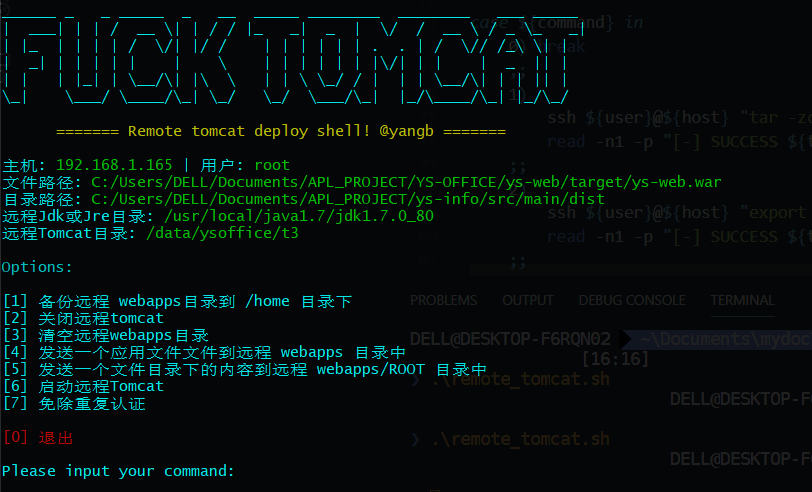

# 远程部署工具



[](https://996.icu/#/zh_CN)
[](https://github.com/996icu/996.ICU/blob/master/LICENSE)

部署文件或目录到远程服务器webapps目录,对tomcat的关闭和启动操作和远程应用的备份功能。

## 功能菜单
  * [1] 备份远程Tomcat webapps目录到 /home 目录下
  * [2] 关闭远程Tomcat服务
  * [3] 清空远程Tomcat webapps目录
  * [4] 发送一个应用文件文件到远程 webapps 目录中
  * [5] 发送一个文件夹下的文件到远程 webapps/ROOT 目录中
  * [6] 启动远程Tomcat
  * [7] 免除重复认证.(命令执行过程中需要重复输入密码，可使用此选项，输入一次即可)

## 使用方法

### 下载项目

```
git clone https://github.com/yangb92/remote_release.git
```

### 修改配置

打开`remote_tomcat.sh`文件,修改配置属性.

```shell
# 远程服务器地址
host="192.168.1.165"
# 服务器登录名
user="root"
# 远程服务器Tomcat所在目录
REMOTE_TOMCAT_DIR="/app/tomcat8"
# 远程服务器java目录(一般情况不用改)
REMOTE_JAVA_HOME="/usr"
# 需要传输的文件路径
app_file="C:/APL_PROJECT/ys-web/target/ys-web.war"
# 需要传输的目录路径
app_dir="C:/APL_PROJECT/ys-info/src/main/dist"
```

### 执行脚本

添加执行权限

```shell
$ cd remote_release
$ chmod +x ./remote_tomcat.sh
```

执行脚本

```
$ ./remote_tomcat.sh
```
>Tips：Windows系统请使用 Git bash 运行此shell脚本.

## Maintainers
[@Yangb92](http://yangb.cf)

## License
MIT © Bin Yang
